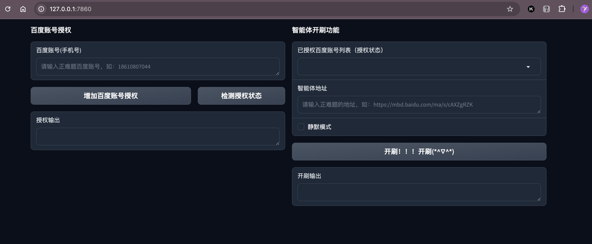

# 百度文心智能体排名优化器

- [作者声明](#作者声明)
- [项目介绍](#项目介绍)
- [联系作者](#联系作者)

## 作者声明

项目代码整理中，整理完毕后会开源部分源代码。源代码仅供学习交流，严禁用于任何商业或非法用途。

## 项目介绍

通过对智能体Ai模拟对话，从而达到对指定的智能体进行排名优化的目的

## 联系作者

如果有学习需求，可联系作者微信或者start该项目获得最新进度。

作者微信：SMariox

加V时请备注说明：智能体排名优化。